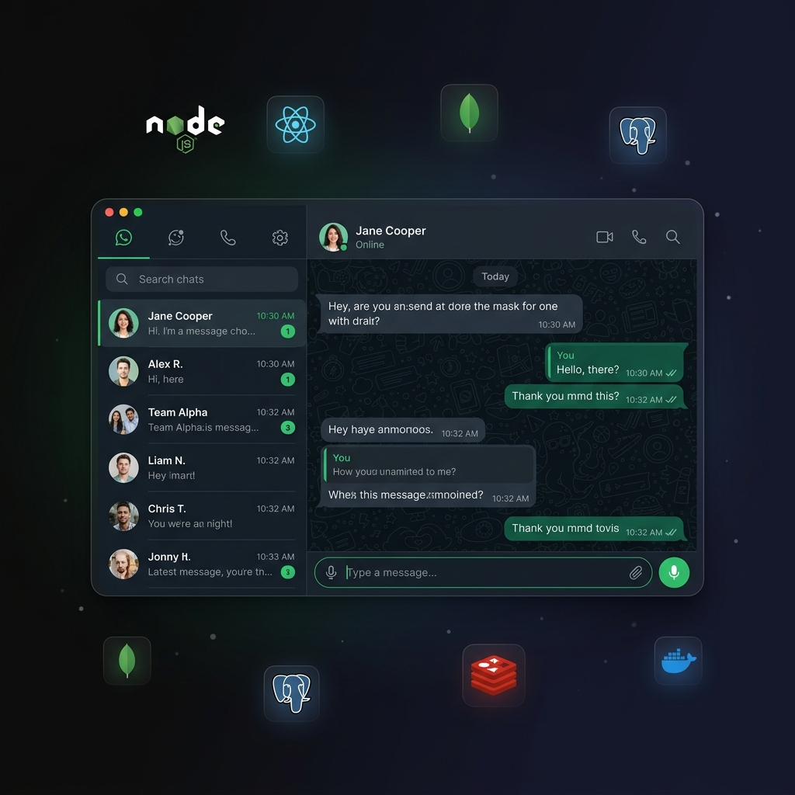

<p align="center">
  
</p>

<h1 align="center">💬 WhatsApp Clone</h1>

<p align="center">
  <strong>A production-grade, microservices-based WhatsApp clone designed for horizontal scale.</strong><br/>
  <em>Real-time messaging · AES-256-GCM encryption · O(1) targeted routing · gRPC · Socket.io · Docker</em>
</p>

<p align="center">
  
  
  
  
  
  
  
  
  
  
</p>

<p align="center">
  <a href="#-features">Features</a> •
  <a href="#-screenshots">Screenshots</a> •
  <a href="#-architecture">Architecture</a> •
  <a href="#-quick-start">Quick Start</a> •
  <a href="#-services">Services</a> •
  <a href="#-api-reference">API</a> •
  <a href="#-authorization-model">Auth Model</a> •
  <a href="#-scaling-strategy">Scaling</a> •
  <a href="#-testing">Testing</a> •
  <a href="#-troubleshooting">Troubleshooting</a> •
  <a href="#-roadmap">Roadmap</a> •
  <a href="#-contributing">Contributing</a>
</p>

---

## 📋 Table of Contents

- [✨ Features](#-features)
- [📸 Screenshots](#-screenshots)
- [🏗 Architecture](#-architecture)
- [🚀 Quick Start](#-quick-start)
- [⚙️ Configuration](#️-configuration)
- [📦 Services](#-services)
- [🔌 API Reference](#-api-reference)
- [🛡 Authorization Model](#-authorization-model)
- [🗃 Database Design](#-database-design)
- [⚡ Scaling Strategy](#-scaling-strategy)
- [🔐 Security](#-security)
- [🧪 Testing](#-testing)
- [📁 Project Structure](#-project-structure)
- [🐳 Docker](#-docker)
- [🩺 Troubleshooting](#-troubleshooting)
- [❓ FAQ](#-faq)
- [🗺 Roadmap](#-roadmap)
- [🤝 Contributing](#-contributing)
- [📜 Code of Conduct](#-code-of-conduct)
- [🔒 Responsible Disclosure](#-responsible-disclosure)
- [📚 Further Reading](#-further-reading)
- [📝 License](#-license)

---

## ✨ Features

### Core Messaging
- 💬 **Real-time 1:1 messaging** over WebSocket (Socket.io) with a Redis adapter for multi-node fan-out
- ✅ **Delivery & read receipts** — Sent (✓) → Delivered (✓✓ gray) → Read (✓✓ blue)
- ⌨️ **Live typing indicators**
- 🔒 **AES-256-GCM at rest** — every message body is encrypted in MongoDB
- 🧹 **Soft delete for messages** (`deletedFor` per user) and **clear chat** (`clearedAt` per user) — other participants are unaffected
- 🚫 **Contact-gated chat** — new conversations only with people in your contacts (enforced at REST + gRPC + Socket)

### User Management
- 🔐 **JWT authentication** — access tokens (15m) + refresh tokens (7d) with Redis-backed revocation
- 👤 **Profiles** — username, avatar, about/status, privacy flags
- 🔍 **User search** — by username or phone
- 📇 **Contacts** — add by phone, remove, block/unblock, custom display names
- 🟢 **Presence** — online status, last-seen, typing state

### Platform & Infrastructure
- 🏗️ **7 independent microservices**, one database per service
- 🚀 **O(1) targeted message routing** via a Redis connection directory (no broadcasts)
- ⚡ **Stateless JWT at the gateway** — zero network calls for auth on the hot path
- 📡 **gRPC for synchronous calls** — `chat-service` ↔ `user-service` use Protocol Buffers
- 🔔 **Redis Pub/Sub + BullMQ** for asynchronous cross-service events and retriable jobs
- 📊 **Structured JSON logging** with per-request correlation IDs
- 🐳 **Fully Dockerized** — a single `docker compose up -d` spins up **12 containers**

---

## 📸 Screenshots

<!-- Replace these with real screenshots/GIFs before going public -->

| Login | Chat List | Conversation |
| --- | --- | --- |
| _(add screenshot)_ | _(add screenshot)_ | _(add screenshot)_ |

| Contacts Panel | Add Contact | Profile |
| --- | --- | --- |
| _(add screenshot)_ | _(add screenshot)_ | _(add screenshot)_ |

> 💡 Drop PNGs/GIFs into `assets/` and reference them here. A short demo GIF at the top of this section is the single highest-impact addition for a public repo.

---

## 🏗 Architecture

### High-Level Overview

```
┌──────────────────────────────────────────────────────────────────────┐
│                    CLIENTS (React SPA / Mobile / API)                │
└─────────────────────────────┬────────────────────────────────────────┘
                              │
                              ▼
┌──────────────────────────────────────────────────────────────────────┐
│                     🔀 API GATEWAY (Port 3000)                        │
│  • Route-based HTTP & WebSocket proxying                             │
│  • Stateless JWT validation (~0.1 ms — NO network call to Auth!)     │
│  • Redis token blacklist for instant revocation                      │
│  • Rate limiting (sliding window per-user + per-IP)                  │
└────┬──────────┬──────────┬──────────┬──────────┬──────────┬──────────┘
     │          │          │          │          │          │
     ▼          ▼          ▼          ▼          ▼          ▼
┌─────────┐┌─────────┐┌──────────┐┌─────────┐┌─────────┐┌──────────────┐
│  🔐      ││  👤      ││  💬       ││  🟢      ││  📁      ││  🔔          │
│  AUTH    ││  USER   ││  CHAT/   ││ PRESENCE││  MEDIA  ││ NOTIFICATION │
│ SERVICE  ││ SERVICE ││ MESSAGE  ││ SERVICE ││ SERVICE ││   SERVICE    │
│ :3001    ││ :3002   ││ :3003    ││ :3004   ││ :3005   ││ :3006        │
└────┬─────┘└────┬────┘└────┬─────┘└────┬────┘└────┬────┘└──────┬───────┘
     │          │          │           │          │             │
     ▼          ▼          ▼           ▼          ▼             ▼
┌─────────┐┌─────────┐┌──────────┐┌─────────┐┌─────────┐┌──────────────┐
│PostgreSQL││PostgreSQL││ MongoDB  ││  Redis  ││ Local / ││  MongoDB     │
│(auth_db) ││(user_db) ││(chat_db) ││(presence││   S3    ││(notif_db)    │
│          ││          ││ SHARDED  ││  store) ││         ││              │
└──────────┘└──────────┘└──────────┘└─────────┘└─────────┘└──────────────┘
```

### Inter-Service Communication

| Pattern | Technology | Example |
|---------|-----------|---------|
| **Synchronous** | gRPC + Protocol Buffers | `chat-service → user-service`: `GetUserProfile`, `CheckContact` |
| **Asynchronous** | Redis Pub/Sub + BullMQ | `chat-service → notification-service`: "new message" event |
| **Real-time** | Socket.io + Redis Adapter | `chat-service → clients`: live message / typing / receipts |

### Message Delivery Flow

```
Alice sends "Hello" to Bob:

1. Alice (browser)  ──WebSocket──▶  API Gateway  ──▶  Chat Service
2. Chat Service verifies sender is a participant of the chat room
3. Chat Service encrypts with AES-256-GCM  ──▶  MongoDB insert
4. Redis GET socket:conn:bob  ──▶  "chat-node-7"           ◀── O(1) lookup
5. Chat Service emits to user:bob room on that node  ──▶  Bob's client
6. Bob's client auto-emits message:delivered             ──▶  Alice sees ✓✓
7. Bob opens the chat  ──▶  message:read                 ──▶  Alice sees ✓✓ (blue)
```

> **Why O(1)?** Instead of broadcasting to all 50 chat nodes (O(N)), we look up Bob's node in the Redis connection directory and target him precisely. At 100B messages/day across 50 nodes this avoids ~4.9 trillion wasted broadcasts daily.

---

## 🚀 Quick Start

### Prerequisites

- [Node.js](https://nodejs.org/) **v20+**
- [Docker](https://www.docker.com/) + Docker Compose **v2**
- (For local dev only) a recent npm (`v10+`) with workspaces support

### Option 1 — Docker (recommended, full stack)

```bash
git clone https://github.com/Raghu128/whatsApp_clone.git
cd whatsApp_clone

# Bring up all 12 containers (infra + services + frontend)
docker compose up -d --build

# Tail logs
docker compose logs -f

# Open the app
open http://localhost:5173
```

Stop and clean up:

```bash
docker compose down          # keep data volumes
docker compose down -v       # wipe volumes too
```

### Option 2 — Local development (hot reload)

```bash
git clone https://github.com/Raghu128/whatsApp_clone.git
cd whatsApp_clone

# 1. Start infrastructure only
docker compose up -d postgres-auth postgres-user mongodb redis

# 2. Install dependencies (npm workspaces)
npm install

# 3. Copy env files
cp .env.example .env
for svc in auth user chat presence media notification api-gateway; do
  cp services/$svc-service/.env.example services/$svc-service/.env 2>/dev/null || true
done

# 4. Start services (each in its own terminal, or use a task runner like concurrently)
npm run dev:auth
npm run dev:user
npm run dev:chat
npm run dev:presence
npm run dev:media
npm run dev:notification
npm run dev:gateway

# 5. Start the frontend
cd frontend && npm install && npm run dev
# ▶ http://localhost:5173
```

> 💡 **Tip:** if you're running services locally but want MongoDB/Postgres/Redis in Docker, the default `.env.example` values already point at `localhost` — just make sure the Docker containers expose ports 5432, 5433, 6379, 27017 (they do by default).

---

## ⚙️ Configuration

Each service has its own `.env.example` and can be configured independently. There is also a root `.env.example` used for shared values.

### Minimum required variables

| Variable | Why it matters | Generate with |
|---|---|---|
| `JWT_SECRET` | Signs/verifies all access tokens. **Must be identical across every service** because the gateway verifies locally. | `openssl rand -hex 32` |
| `ENCRYPTION_KEY` | Key for AES-256-GCM of message bodies. **Must be 64 hex characters (32 bytes).** | `openssl rand -hex 32` |

> ⚠️ If you rotate `ENCRYPTION_KEY`, **previously stored messages become unreadable.** Plan a key-rotation migration before changing it in production.

### Full variable matrix

| Variable | Default | Services | Purpose |
|---|---|---|---|
| `NODE_ENV` | `development` | all | Mode flag |
| `LOG_LEVEL` | `debug` | all | Pino level: `debug` / `info` / `warn` / `error` |
| `JWT_SECRET` | — | auth, gateway, all | HS256 secret |
| `JWT_ACCESS_EXPIRY` | `15m` | auth | Access token TTL |
| `JWT_REFRESH_EXPIRY` | `7d` | auth | Refresh token TTL |
| `ENCRYPTION_KEY` | — | chat, shared | AES-256-GCM key (64 hex chars) |
| `REDIS_HOST` / `REDIS_PORT` / `REDIS_PASSWORD` | `localhost` / `6379` / — | all | Redis connection |
| `AUTH_DB_*` | `localhost:5432 / auth_db / postgres / postgres_password` | auth | Auth Postgres |
| `USER_DB_*` | `localhost:5433 / user_db / postgres / postgres_password` | user | User Postgres |
| `CHAT_DB_URI` | `mongodb://localhost:27017/chat_db` | chat | Messages/Rooms |
| `NOTIFICATION_DB_URI` | `mongodb://localhost:27017/notification_db` | notification | Notifications |
| `*_SERVICE_PORT` | 3000–3006 | each | HTTP port |
| `AUTH_GRPC_PORT` | `50051` | auth | gRPC port |
| `USER_GRPC_PORT` | `50052` | user | gRPC port |
| `USER_GRPC_URL` | `localhost:50052` | chat | gRPC client target |
| `*_SERVICE_URL` | `http://localhost:3001–3006` | gateway | Proxy upstreams |
| `STORAGE_TYPE` | `local` | media | `local` or `s3` |
| `UPLOAD_DIR` | `./uploads` | media | Local storage path |
| `MAX_FILE_SIZE` | `50mb` | media | Multer limit |

> **Docker users** should use `.env.docker` (already in the repo) — it replaces `localhost` with the compose service names (e.g. `redis`, `mongodb`).

---

## 📦 Services

### 🔐 Auth Service — port `3001`

Registration, login, JWT lifecycle.

| Concern | Implementation |
|---|---|
| Password hashing | bcrypt (12 salt rounds) |
| Access tokens | JWT HS256, 15-minute expiry |
| Refresh tokens | 7-day expiry, persisted in Postgres |
| Revocation | Redis blacklist with auto-expiring TTL |
| Storage | PostgreSQL (`auth_db`) |
| gRPC | `auth.proto` — exposes token validation helpers |

### 👤 User Service — port `3002`, gRPC `50052`

Profiles, contacts, search. Exposes gRPC to other services.

| Concern | Implementation |
|---|---|
| Profile | `username`, `avatar_url`, `status_message`, privacy flags |
| Contacts | Add by phone, remove, block/unblock, custom nickname |
| Search | Case-insensitive `username` or `phone` match |
| gRPC | `GetUserProfile`, `GetUserProfiles`, `GetGroupMembers`, **`CheckContact`** |
| Storage | PostgreSQL (`user_db`) |

### 💬 Chat Service — port `3003`

Real-time messaging and persistence.

| Concern | Implementation |
|---|---|
| Real-time | Socket.io + Redis adapter (horizontal fan-out) |
| Encryption | AES-256-GCM at rest |
| Routing | O(1) Redis connection directory |
| Receipts | `sent → delivered → read` per-message |
| Auth guards | **Contact-gated chat creation (gRPC `CheckContact`) + participant check on every `message:send`** |
| Soft delete | Per-user `deletedFor[]` + per-user `clearedAt` map |
| Storage | MongoDB (`chat_db`) — shardable on `chatRoomId` |

### 🟢 Presence Service — port `3004`

Online status and last-seen.

| Concern | Implementation |
|---|---|
| Heartbeat | Client every 25s, TTL 30s in Redis |
| Last seen | Persisted in Redis on disconnect |
| Typing | 3s TTL auto-expire |
| Storage | Redis only (no persistent DB) |

### 📁 Media Service — port `3005`

File uploads and thumbnails.

| Concern | Implementation |
|---|---|
| Upload | Multer, MIME/size validated |
| Processing | BullMQ queue (async thumbnailing) |
| Backend | Local FS (dev) or S3 (prod) behind a provider interface |
| Supported | Images, video, audio, documents |

### 🔔 Notification Service — port `3006`

Async push/notification handling.

| Concern | Implementation |
|---|---|
| Event source | Redis Pub/Sub subscriber |
| Queue | BullMQ for retriable jobs |
| Storage | MongoDB (`notification_db`) with 30-day TTL |
| Delivery | WebSocket push (FCM/APNs slots prepared, not wired) |

### 🔀 API Gateway — port `3000`

Single entry point for clients.

| Concern | Implementation |
|---|---|
| HTTP proxy | `http-proxy-middleware` |
| WebSocket proxy | Routes to chat-service |
| Auth | **Stateless** JWT verification (no hop to auth-service) |
| Rate limits | Redis sliding window, per-user and per-IP |
| Hardening | Helmet, CORS whitelist, compression |

---

## 🔌 API Reference

All endpoints are mounted behind the API Gateway at `http://localhost:3000`. Responses follow a uniform envelope:

```json
{
  "success": true,
  "data": { /* ... */ },
  "message": "Human-readable status"
}
```

Errors use the same envelope with `success: false`, plus a stable machine-readable `code` (e.g. `NOT_A_CONTACT`, `CONTACT_BLOCKED`, `NOT_FOUND`).

### Auth

| Method | Endpoint | Auth | Description |
|---|---|---|---|
| `POST` | `/api/v1/auth/register` | public | Create account |
| `POST` | `/api/v1/auth/login` | public | Returns `{ user, tokens }` |
| `POST` | `/api/v1/auth/refresh` | public | Exchange refresh for new access token |
| `POST` | `/api/v1/auth/logout` | bearer | Blacklist current access + refresh |
| `GET`  | `/api/v1/auth/me` | bearer | Current user |

### Users

| Method | Endpoint | Body / Query | Description |
|---|---|---|---|
| `GET`    | `/api/v1/users/profile` | — | Own profile |
| `PUT`    | `/api/v1/users/profile` | `{ username?, about?, last_seen_privacy?, ... }` | Update profile |
| `POST`   | `/api/v1/users/avatar` | `{ avatar_url }` | Set avatar URL on profile |
| `GET`    | `/api/v1/users/search?q=` | query `q` | Search by username/phone |
| `GET`    | `/api/v1/users/:id` | — | Get user by UUID |
| `GET`    | `/api/v1/users/contacts` | — | List own contacts (includes `contactDetails`) |
| `POST`   | `/api/v1/users/contacts` | `{ targetPhone, customName? }` | **Add contact by phone** |
| `DELETE` | `/api/v1/users/contacts/:contactUserId` | — | Remove a contact |
| `POST`   | `/api/v1/users/contacts/:contactUserId/block` | — | Block a contact |

### Chats & Messages

| Method | Endpoint | Body / Query | Description |
|---|---|---|---|
| `GET`    | `/api/v1/chats` | — | List chat rooms for current user |
| `POST`   | `/api/v1/chats` | `{ targetUserId }` | **Create or fetch private chat** — enforces contact check. Returns `403 NOT_A_CONTACT` or `403 CONTACT_BLOCKED` if blocked |
| `GET`    | `/api/v1/chats/:id/messages?cursor=<ISO>` | — | Paginated messages, honors `clearedAt` + `deletedFor` |
| `DELETE` | `/api/v1/chats/:id` | — | **Clear chat** (per-user soft clear) |
| `DELETE` | `/api/v1/chats/messages/:id` | — | **Delete message for me** (adds user to `deletedFor`) |

### Presence

| Method | Endpoint | Body | Description |
|---|---|---|---|
| `POST` | `/api/v1/presence/heartbeat` | — | Update own `lastSeen` / `isOnline` in Redis |
| `GET`  | `/api/v1/presence/:userId` | — | Status of one user |
| `POST` | `/api/v1/presence/bulk` | `{ userIds: [] }` | Bulk status lookup |

### Notifications

| Method | Endpoint | Description |
|---|---|---|
| `GET`    | `/api/v1/notifications?page=` | Paginated list |
| `GET`    | `/api/v1/notifications/unread-count` | Unread count |
| `PUT`    | `/api/v1/notifications/:id/read` | Mark single read |
| `PUT`    | `/api/v1/notifications/read-all` | Mark all read |

### Media

| Method | Endpoint | Form / Params | Description |
|---|---|---|---|
| `POST` | `/api/v1/media/upload` | `multipart/form-data` field `file` | Upload (returns BullMQ `jobId`) |
| `GET`  | `/api/v1/media/:id` | — | Stream original file |
| `GET`  | `/api/v1/media/thumbnail/:id` | — | Stream thumbnail |

### WebSocket Events

**Client → Server:**

| Event | Payload | Description |
|---|---|---|
| `message:send` | `{ chatRoomId, receiverId, text, messageType?, mediaUrl? }` | Send message. Fails if sender is not a participant. |
| `message:delivered` | `{ messageId, senderId }` | Acknowledge delivery |
| `message:read` | `{ messageId, senderId }` | Acknowledge read |
| `typing:start` / `typing:stop` | `{ receiverId }` | Typing indicators |
| `heartbeat` | — | Presence keep-alive |

**Server → Client:**

| Event | Payload | Description |
|---|---|---|
| `message:new` | `{ messageId, chatRoomId, senderId, content, createdAt, ... }` | New message |
| `message:status` | `{ messageId, status }` | Status update |
| `typing:status` | `{ userId, status }` | Other user's typing state |
| `heartbeat:ack` | `{ timestamp }` | Heartbeat response |

---

## 🛡 Authorization Model

The rule is **"only contacts can start new chats"** — mirroring real-world WhatsApp. It is enforced in three layers, so bypassing any one of them still fails:

1. **REST guard (primary)** — `POST /api/v1/chats`
   - `chat-service` calls `user-service` via gRPC `CheckContact(ownerUserId, targetUserId)` before creating a new `ChatRoom`.
   - Returns `403 NOT_A_CONTACT` or `403 CONTACT_BLOCKED` with machine-readable `code` fields.
   - **Existing chats keep working** — removing a contact does not delete history.
2. **Socket guard** — `message:send`
   - Every sent message is checked against `ChatRoom.participants`. This prevents a client from skipping REST and sending directly via Socket.io with a guessed `chatRoomId`.
3. **Frontend UX** — `Sidebar`
   - On `NOT_A_CONTACT`, the frontend prompts the user to add the person as a contact, pre-fills phone & name, and retries chat creation automatically after success.

**Sequence:**

```
Client ──▶ API Gateway ──▶ Chat Service ──gRPC CheckContact──▶ User Service
                                  │                                   │
                                  ◀──── { exists, isBlocked } ────────┘
                                  │
                     if !exists or blocked → 403 {code}
                     else → ChatRoom.findOrCreate
```

> Prefer to disable contact-gating for testing? Stub out `userGrpcClient.checkContact` in `services/chat-service/src/grpc/userClient.js` to always return `{ exists: true }`.

---

## 🗃 Database Design

Each service owns its database. **No service directly queries another service's tables.** Cross-service data flows through gRPC (sync) or Redis events (async).

```
auth-service          ──▶ PostgreSQL (auth_db)           users, refresh_tokens
user-service          ──▶ PostgreSQL (user_db)           user_profiles, contacts, groups
chat-service          ──▶ MongoDB   (chat_db)            chatrooms, messages   (shardable)
notification-service  ──▶ MongoDB   (notification_db)    notifications         (30-day TTL)
presence-service      ──▶ Redis                          online + typing + lastSeen
media-service         ──▶ Local FS / S3                  blobs
```

### Message schema (MongoDB)

```js
{
  _id: ObjectId,
  chatRoomId: ObjectId,          // Shard key (hashed)
  senderId: UUID,
  messageType: 'text' | 'image' | 'video' | 'audio' | 'document',
  content: {                     // AES-256-GCM encrypted body
    iv: String,
    authTag: String,
    encryptedData: String
  },
  status: 'sent' | 'delivered' | 'read',
  deliveredTo: Map<userId, Date>,
  readBy:      Map<userId, Date>,
  isDeleted:   Boolean,          // hard-delete flag (unused yet)
  deletedFor:  [UUID],           // per-user soft delete
  isStarredBy: [UUID],
  createdAt: Date
}
```

### ChatRoom schema (MongoDB)

```js
{
  _id: ObjectId,
  type: 'private' | 'group',
  participants: [UUID],          // user_ids
  lastMessage: { messageId, text, senderId, createdAt },
  groupMetadata: { groupId, name, avatarUrl },
  clearedAt: Map<userId, Date>,  // per-user "clear chat" timestamp
  createdAt: Date,
  updatedAt: Date
}
```

### Sharding strategy

Messages shard on `chatRoomId` (hashed) so every message in a conversation lives on the same shard — fast range reads, no scatter/gather. Adding shards is zero-downtime:

```js
sh.enableSharding("chat_db")
sh.shardCollection("chat_db.messages", { chatRoomId: "hashed" })
sh.addShard("shard4-rs/shard4-host:27018")
```

---

## ⚡ Scaling Strategy

### Capacity envelope

| Tier | Setup | Concurrent users | Messages / day |
|---|---|---|---|
| **Dev** | Single host, Docker Compose | ~100 | ~10K |
| **Small** | 3 hosts, basic replication | ~10K | ~1M |
| **Medium** | K8s, 3–5 replicas per service | ~500K | ~100M |
| **Large** | K8s, sharded MongoDB, Redis Cluster | ~10M | ~10B |
| **XL** | Full topology below | ~100M+ | ~100B+ |

### Replica strategy

| Service | Replicas | Why |
|---|---|---|
| API Gateway | 3–5 | Stateless, scale behind LB |
| Auth | 2–3 | Cold path after login |
| User | 3–5 | Profile reads, search |
| **Chat** | **20–50+** | Highest load: Socket.io + message throughput |
| Presence | 10–20 | High: heartbeats every 25s |
| Media | 5–10 | CPU-bound image/video work |
| Notification | 5–10 | Bursty on group messages |

### Scaling invariants

| Decision | Payoff |
|---|---|
| Stateless JWT at gateway | Gateway scales independently of auth-service |
| O(1) connection directory | Targeted routing, no broadcast storms |
| MongoDB hashed sharding | Add shards without code changes |
| Redis Cluster (16384 slots) | Auto-distributes keys |
| DB-per-service | Scale each DB independently |
| Event-driven async | Services don't block each other |

### Production topology (~130 containers)

```
Services (Kubernetes)
  api-gateway           ×5
  auth-service          ×3
  user-service          ×5
  chat-service         ×50
  presence-service     ×20
  media-service        ×10
  notification-service ×10

Databases
  Postgres (auth)      1 Primary + 2 Read Replicas + PgBouncer
  Postgres (user)      1 Primary + 2 Read Replicas + PgBouncer
  MongoDB (messages)   3 mongos + 3 config + 6 shards × 3 replicas = 24 nodes
  MongoDB (notif)      1 Primary + 2 Secondaries
  Redis Cluster        6 nodes (3 primary + 3 replicas)
```

---

## 🔐 Security

| Layer | Implementation |
|---|---|
| Password hashing | bcrypt, 12 salt rounds |
| Auth tokens | JWT (access 15m, refresh 7d) |
| Token validation | Stateless at gateway (shared `JWT_SECRET`) |
| Token revocation | Redis blacklist with auto-TTL |
| Message payload | **AES-256-GCM** at rest |
| Contact gating | gRPC `CheckContact` + Socket participant check |
| Rate limiting | Redis sliding window (per-user + per-IP) |
| Input validation | Joi schemas per service |
| Secure headers | Helmet (XSS, CSP, HSTS) |
| CORS | Explicit origin whitelist |
| Correlation IDs | End-to-end request tracing |

### Rate limits (defaults)

```
message:send     → 100 messages/minute
media:upload     →  10 uploads/minute
auth:login       →   5 attempts/15 minutes
user:search      →  30 searches/minute
general:api      → 1000 requests/minute (per user)
per-IP (DDoS)    → 5000 requests/minute
```

---

## 🧪 Testing

Every service has its own Jest config; the root `npm test` runs them all.

```bash
# All services
npm test

# Single service
npm test --workspace=services/chat-service

# Watch mode
npm test --workspace=services/chat-service -- --watch
```

> Test coverage is a work in progress — see the [roadmap](#-roadmap). PRs adding tests are particularly welcome. When adding tests:
> - Prefer integration tests that boot the service against in-memory infra (e.g. [mongodb-memory-server](https://github.com/nodkz/mongodb-memory-server) for MongoDB, `ioredis-mock` for Redis).
> - For controllers, spin up Express with `supertest`.
> - For gRPC clients (`chat → user`), mock the client module; there's no need to boot a real gRPC server.

---

## 📁 Project Structure

```
whatsApp_clone/
├── services/
│   ├── api-gateway/          Route proxying, JWT validation, rate limiting
│   ├── auth-service/         Registration, login, token management (Postgres)
│   ├── user-service/         Profiles, contacts, gRPC server
│   ├── chat-service/         Socket.io, messaging, encryption, receipts
│   ├── presence-service/     Online status, heartbeats, last seen (Redis only)
│   ├── media-service/        File uploads, thumbnails, BullMQ workers
│   └── notification-service/ Event subscriber, push notifications, queues
├── shared/                   Shared libraries used by all services
│   ├── config/               Joi-based env validation
│   ├── events/               Event names, schemas, publisher/subscriber helpers
│   ├── middleware/           errorHandler, validator, requestLogger
│   ├── proto/                gRPC .proto definitions (user.proto, auth.proto)
│   ├── templates/            baseApp, baseServer
│   └── utils/                logger (Pino), encryption (AES-GCM), responseFormatter
├── frontend/                 React + Vite SPA
│   ├── src/
│   │   ├── components/       Sidebar, ChatArea, ContactsPanel, AddContactModal, ...
│   │   ├── pages/            LoginPage, RegisterPage, ChatPage
│   │   ├── stores/           Zustand: auth, chat, presence, notification
│   │   └── services/         api.js (axios), socket.js (socket.io-client)
│   └── nginx.conf            Production reverse proxy
├── docker-compose.yml        Full-stack orchestration (12 containers)
├── Dockerfile.backend        Reusable backend image (all 7 services via ARG)
├── Dockerfile.frontend       Multi-stage Vite build → Nginx
├── .env.example              Root env template
├── .env.docker               Docker-specific overrides
├── docs/
│   ├── ARCHITECTURE.md       Deep-dive system design document
│   └── PHASES.md             Build journey: phases & milestones
└── package.json              npm workspaces root
```

---

## 🐳 Docker

### Containers (12)

| Container | Image | Host port | Purpose |
|---|---|---|---|
| `whatsapp-postgres-auth` | postgres:16-alpine | 5432 | Auth credentials |
| `whatsapp-postgres-user` | postgres:16-alpine | 5433 | User profiles/contacts |
| `whatsapp-mongodb` | mongo:7.0 | 27017 | Messages + notifications |
| `whatsapp-redis` | redis:7-alpine | 6379 | Cache / events / presence / sessions |
| `whatsapp-api-gateway` | Dockerfile.backend | 3000 | Client entry point |
| `whatsapp-auth-service` | Dockerfile.backend | — | Auth HTTP + gRPC |
| `whatsapp-user-service` | Dockerfile.backend | — | User HTTP + gRPC |
| `whatsapp-chat-service` | Dockerfile.backend | — | Chat HTTP + Socket.io |
| `whatsapp-presence-service` | Dockerfile.backend | — | Presence HTTP |
| `whatsapp-media-service` | Dockerfile.backend | — | Media HTTP + BullMQ worker |
| `whatsapp-notification-service` | Dockerfile.backend | — | Event subscriber + queue |
| `whatsapp-frontend` | Dockerfile.frontend | 5173 | React (Nginx) |

> Internal services are **not exposed** on host ports by default — only the gateway (3000) and frontend (5173). All inter-service traffic uses the Docker network.

### Common commands

```bash
docker compose up -d --build             # Build & start
docker compose logs -f                   # Stream everything
docker compose logs chat-service -f      # One service
docker compose restart chat-service      # Restart one
docker compose up -d --build chat-service
docker compose down                      # Stop (keep volumes)
docker compose down -v                   # Stop + wipe data
docker compose exec mongodb mongosh chat_db   # Shell into Mongo
docker compose exec redis redis-cli            # Shell into Redis
```

---

## 🩺 Troubleshooting

<details>
<summary><strong><code>invalid input syntax for type uuid</code> in user-service logs</strong></summary>

Route-ordering bug: a static path (e.g. `/contacts`) was declared after a wildcard (`/:id`). Express matched the wildcard, treated the string `"contacts"` as a UUID, and Postgres rejected it.
**Fix:** always declare static routes before `/:id` routes. See `services/user-service/src/routes/user.routes.js` for the canonical ordering.
</details>

<details>
<summary><strong>Clear Chat succeeds but messages reappear on reload</strong></summary>

Older versions persisted `clearedAt` but the `getMessages` endpoint didn't read it. Current code filters `createdAt > clearedAt[userId]` and merges correctly with cursor pagination. Pull the latest `services/chat-service/src/controllers/message.controller.js`.
</details>

<details>
<summary><strong><code>403 NOT_A_CONTACT</code> when starting a chat</strong></summary>

Expected. Only contacts can start chats. Add the user by phone via **Contacts → Add contact**, then try again. The frontend will also prompt you automatically.
</details>

<details>
<summary><strong>Socket disconnects every 25 seconds</strong></summary>

The presence heartbeat is configured for 25 s with a 30 s TTL. If you see disconnects, check:
- `JWT_SECRET` matches between gateway and chat-service,
- Reverse proxies (Nginx) aren't closing idle WebSocket connections (use `proxy_read_timeout 3600;`).
</details>

<details>
<summary><strong>gRPC <code>UNAVAILABLE</code> when creating a chat</strong></summary>

`chat-service` couldn't reach `user-service:50052`.
- Local dev: confirm `user-service` is running and `USER_GRPC_URL=localhost:50052`.
- Docker: confirm containers are on the same network and use `user-service:50052`.
- The controller falls back with `503 USER_SERVICE_UNAVAILABLE` rather than silently allowing the chat.
</details>

<details>
<summary><strong>"Messages encrypted but won't decrypt"</strong></summary>

Your `ENCRYPTION_KEY` changed. It must be **exactly 64 hex characters** and identical across every process that reads/writes messages. Rotating the key requires a re-encrypt migration.
</details>

<details>
<summary><strong>Port already in use</strong></summary>

Default ports are 3000–3006, 5173, 5432, 5433, 6379, 27017, 50051, 50052. Either kill the conflicting process or override the port env var for that service.
</details>

---

## ❓ FAQ

<details>
<summary><strong>Is this end-to-end encrypted?</strong></summary>

Not in the Signal sense — this is **server-side** AES-256-GCM at rest. The server can still read messages. True E2EE (Signal protocol / X3DH / Double Ratchet) is on the roadmap.
</details>

<details>
<summary><strong>Can I use a single Postgres for both auth_db and user_db?</strong></summary>

Technically yes (just point both `AUTH_DB_*` and `USER_DB_*` at the same host). Keeping them separate keeps the "DB per service" invariant clean, makes migrations independent, and lets you scale them separately later.
</details>

<details>
<summary><strong>Why Socket.io and not raw WebSocket?</strong></summary>

Socket.io gives us transport fallback, reconnection, rooms, an ack protocol, and — critically — a Redis adapter for multi-node broadcast. Raw WS would require reimplementing all of that.
</details>

<details>
<summary><strong>Do I need Docker to run this?</strong></summary>

No — you can run Node services locally and point them at existing Postgres/MongoDB/Redis (or point at just those containers via Docker). Docker is simply the fastest path.
</details>

<details>
<summary><strong>Where is group chat?</strong></summary>

Schemas support `type: 'group'` but the REST routes are stubbed (`501 Not implemented`). See the [roadmap](#-roadmap).
</details>

---

## 🗺 Roadmap

- [ ] **End-to-end encryption** (Signal-style double ratchet)
- [ ] **Group chats** — create/manage/admin controls; the `groupMetadata` schema is already in place
- [ ] **Media messaging** end-to-end in the UI (attach button is currently decorative)
- [ ] **Avatar upload** flow end-to-end (media-service returns `jobId` today; needs a synchronous URL path or polling)
- [ ] **Notifications UI** (store exists, component missing)
- [ ] **Voice/video calls** via WebRTC + a TURN server
- [ ] **Search within a conversation** (Mongo text index)
- [ ] **Reactions & reply threads** (schema slot exists for replies)
- [ ] **Per-message hard delete** ("delete for everyone" — currently UI-only)
- [ ] **Read test coverage above 70 %** for each service
- [ ] **Observability**: OpenTelemetry traces, Prometheus metrics, Grafana dashboards
- [ ] **CI**: GitHub Actions for lint + test + docker build on PR

Contributions to any of these are welcome — see below.

---

## 🤝 Contributing

First of all: **thank you** for considering a contribution! Even small improvements (typos, tests, better error messages) are hugely appreciated.

### Workflow

1. **Fork** the repo.
2. **Create a branch:** `git checkout -b feat/my-feature` or `fix/my-bug`.
3. **Install & run:** follow [Quick Start → Local dev](#option-2--local-development-hot-reload).
4. **Make changes** and add tests where possible.
5. **Commit** using [Conventional Commits](https://www.conventionalcommits.org/):
   ```
   feat(chat): block non-contact chat creation
   fix(user): correct route order for /contacts vs /:id
   docs(readme): add troubleshooting section
   test(chat): integration test for clearChat
   ```
6. **Push** and open a PR against `main`. Use a descriptive title, and in the body include:
   - Motivation / linked issue
   - Summary of the change
   - Screenshots for UI changes
   - How you tested it

### Code guidelines

- **Each service is independently deployable.** Don't cross service-owned DB boundaries — use gRPC (sync) or the event bus (async).
- **Validate input** with Joi for any new REST endpoint (`shared/middleware/validator.js`).
- **Log through the shared logger** (`@whatsapp-clone/shared/utils/logger`), never `console.log`.
- **No magic strings for events** — add them to `shared/events/eventSchemas.js`.
- **Respect the uniform response envelope** (`success`, `data`, `message`, `code`).
- **Keep routes ordered** — static paths before `/:param` wildcards (classic Express footgun).
- **Comments explain why, not what.** Avoid narrating the obvious.

### Good first issues

Look for issues tagged [`good first issue`](https://github.com/Raghu128/whatsApp_clone/issues?q=label%3A%22good+first+issue%22) or [`help wanted`](https://github.com/Raghu128/whatsApp_clone/issues?q=label%3A%22help+wanted%22). Anything on the [Roadmap](#-roadmap) is fair game.

---

## 📜 Code of Conduct

This project adopts the [Contributor Covenant v2.1](https://www.contributor-covenant.org/version/2/1/code_of_conduct/). Be kind, be constructive, and assume good intent. Reports of unacceptable behavior go to the email in the project's GitHub profile.

---

## 🔒 Responsible Disclosure

If you find a security vulnerability, **please do not open a public issue**. Instead:

1. Email the maintainer (see GitHub profile) with:
   - A description of the issue
   - Reproduction steps or proof-of-concept
   - The commit / version you tested against
2. You'll get an acknowledgement within 72 hours.
3. A fix will be shipped and the advisory will credit you (if you want credit).

---

## 📚 Further Reading

If you want to go deeper than this README:

- 📐 **[docs/ARCHITECTURE.md](docs/ARCHITECTURE.md)** — the full system-design deep dive: tech stack rationale, sharding strategy, Redis hash slots, O(1) routing math, and capacity planning.
- 🧱 **[docs/PHASES.md](docs/PHASES.md)** — build journey. The project was implemented in 10 phases; this file is the checklist of every task that went into each phase, useful if you want to understand *how* this was built, not just *what* it is.

---

## 📝 License

This project is licensed under the **MIT License** — see the [LICENSE](LICENSE) file for details.

---

## 🙏 Acknowledgments

- Architecture inspired by [WhatsApp's Erlang process registry](https://www.erlang-solutions.com/blog/20-years-of-open-source-erlang-openerlang/) for targeted message routing
- Chunk-based sharding follows MongoDB's production recommendations
- Shout-out to every blog post and talk about scaling chat systems at Meta, Discord, and Slack — you made this much easier to reason about

---

<p align="center">
  Built with ❤️ by <a href="https://github.com/Raghu128">Raghu Kumar</a><br/>
  ⭐ If this project helped you, consider starring the repo!
</p>
