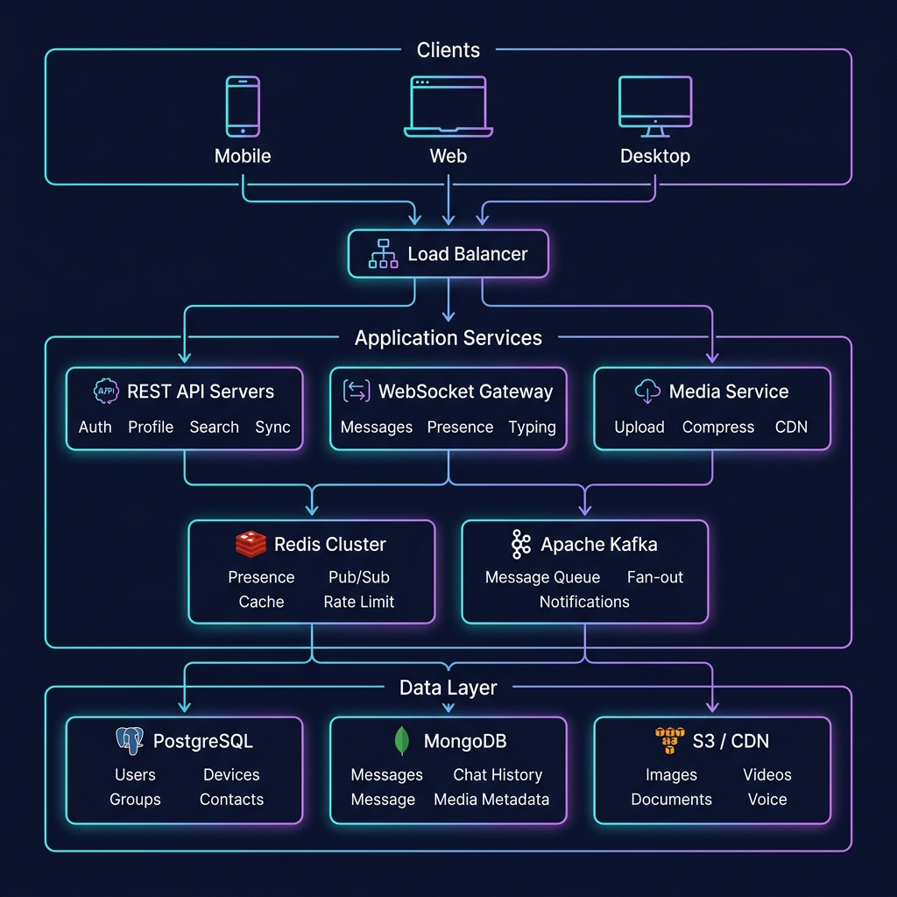

<p align="center">
  
</p>

<h1 align="center">WhatsApp Backend Clone</h1>

<p align="center">
  <strong>A production-grade, billion-scale real-time messaging backend with multi-device support</strong>
</p>

<p align="center">
  <a href="#features">Features</a> •
  <a href="#architecture">Architecture</a> •
  <a href="#tech-stack">Tech Stack</a> •
  <a href="#getting-started">Getting Started</a> •
  <a href="#api-documentation">API Docs</a> •
  <a href="#database-design">Database</a> •
  <a href="#scaling-strategy">Scaling</a> •
  <a href="#contributing">Contributing</a>
</p>

<p align="center">
  
  
  
  
  
  
  
</p>

---

## 📖 Overview

A WhatsApp-inspired backend system designed to handle **billions of users** with real-time messaging, multi-device synchronization, and a 5-state message delivery pipeline. Built with a modular architecture that can scale horizontally across geographic regions.

This is **not a tutorial project**. It implements the same architectural patterns used by production messaging systems — including cross-server WebSocket routing via Redis Pub/Sub, per-device offline message queuing, and fan-out-on-write for group delivery.

---

## ✨ Features

### 🔐 Authentication & Multi-Device
- **Phone-based OTP registration** with JWT access + refresh tokens
- **Multi-device support** — up to 5 devices per user (1 primary + 4 linked)
- **QR code device linking** — scan from primary device to link web/desktop
- **Per-device encryption keys** and independent session management
- **Remote device revocation** — log out any device from any other device

### 💬 Real-Time Messaging
- **1:1 private chat** with sub-100ms delivery via WebSocket
- **Group chat** — up to 1024 members with admin roles (superadmin / admin / member)
- **Message types** — Text, Image, Video, Audio, Document, Location, Contact, Sticker
- **Reply, Forward, Edit** (15-min window), **Delete for Everyone** (1-hour window)
- **Message reactions** — emoji reactions with real-time sync across devices
- **Disappearing messages** — configurable TTL auto-deletion (24h / 7d / 90d)

### ✅ 5-State Message Delivery Pipeline

```
 PENDING ──▶ SENT ──▶ DELIVERED ──▶ READ ──▶ PLAYED
   ⏳          ✓         ✓✓         ✓✓🔵       🎧
 (client)  (server)  (received)   (opened)  (audio)
```

- **Per-recipient, per-device** delivery tracking
- Multi-device rule: DELIVERED when **first** recipient device receives
- Batch read receipts on chat open
- Privacy toggle: disable blue ticks (still tracked internally)

### 🟢 Presence System
- **Online/Offline status** — user is online if ANY device has an active WebSocket
- **Last Seen** — timestamp of when the last device disconnected
- **Typing indicators** — real-time "typing..." with auto-expire
- **Privacy controls** — last seen visible to Everyone / Contacts / Nobody
- **Reciprocal privacy** — hide yours → can't see others'

### 📱 Multi-Device Sync
- **Per-device offline queues** — messages queued when device is disconnected
- **Sequence-based sync protocol** — reconnecting devices catch up via `last_sync_seq`
- **Cross-device message sync** — sent messages appear on all sender devices
- **Conflict resolution** — server is source of truth (last-write-wins for settings)

### 📎 Media Service
- **Pre-signed URL uploads** — client uploads directly to S3 (server never handles the file)
- **Automatic thumbnail generation** — inline base64 thumbnails for instant preview
- **Video/Image compression** — optimized delivery via CDN
- **Supported formats** — Images (16MB), Videos (64MB), Audio (16MB), Documents (100MB)

### 🔔 Smart Notifications
- **Firebase FCM** (Android/Web) + **Apple APNs** (iOS)
- **Intelligent suppression** — no push if user is actively viewing the chat
- **Notification grouping** — "3 messages from John" instead of 3 separate pushes
- **@mention override** — push even in muted groups when mentioned

### 🔒 Privacy & Security
- **Granular privacy controls** — last seen, avatar, about (Everyone / Contacts / Nobody)
- **User blocking** — blocked users can't message, call, or view profile
- **Rate limiting** — Redis sliding window counters per action type
- **Input validation** — Joi/Zod schemas on every endpoint
- **Helmet.js** security headers + CORS policy

---

## 🏗️ Architecture

<p align="center">
  
</p>

### Three-Server Architecture

| Server | Role | Protocol | Scaling |
|--------|------|----------|---------|
| **REST API Server** | Auth, Profiles, Groups, Search, Sync | HTTP/HTTPS | Stateless — Round Robin LB |
| **WebSocket Gateway** | Real-time messaging, Presence, Typing | WSS | Stateful — Sticky Sessions (IP Hash) |
| **Media Service** | Upload, Compression, Thumbnails | HTTP/HTTPS | Stateless — Least Connections LB |

### Cross-Server Message Routing

When User A is connected to WS Server 1 and User B is on WS Server 3:

```
User A ──▶ WS Server 1 ──▶ Redis Pub/Sub ──▶ WS Server 3 ──▶ User B
```

Each WebSocket server subscribes to its own Redis channel (`deliver:{serverId}`). Messages are routed via publish/subscribe — providing **O(1) routing** regardless of server count.

### Message Flow

```
Client sends message
       │
       ▼
  WebSocket Gateway receives
       │
       ├──▶ Persist to MongoDB (message_id + sequence_number)
       ├──▶ ACK to sender: SENT ✓
       ├──▶ Sync to sender's other devices
       └──▶ Publish to Kafka (topic: messages)
              │
              ▼
         Message Consumer
              │
              ├──▶ Online devices → Push via WebSocket
              ├──▶ Offline devices → Queue in Redis
              └──▶ All offline → Send Push Notification
              
         Recipient device ACKs → Status: DELIVERED ✓✓
         Recipient opens chat  → Status: READ ✓✓🔵
```

---

## 🛠️ Tech Stack

| Layer | Technology | Purpose |
|-------|-----------|---------|
| **Runtime** | Node.js 18+ | Event-driven, non-blocking I/O |
| **REST Framework** | Express.js | HTTP API routing |
| **Real-Time** | Socket.IO | WebSocket with fallback support |
| **Auth** | JWT (jsonwebtoken) | Stateless access + refresh tokens |
| **Relational DB** | PostgreSQL 15 | Users, Devices, Groups, Contacts |
| **Document DB** | MongoDB 7 | Messages, Chat History, Media Metadata |
| **Cache / Pub-Sub** | Redis 7 | Presence, Routing, Offline Queues, Rate Limiting |
| **Message Queue** | Apache Kafka | Async message fan-out, notifications |
| **Object Storage** | AWS S3 / Cloudflare R2 | Images, Videos, Documents, Voice Notes |
| **Search** | Elasticsearch | Full-text message search |
| **Push Notifications** | FCM + APNs | Mobile/Web push when offline |
| **Load Balancer** | NGINX | Reverse proxy, SSL termination, sticky sessions |
| **Containerization** | Docker + Docker Compose | Local dev + deployment |
| **Validation** | Joi / Zod | Input sanitization on every endpoint |
| **Logging** | Pino | Structured JSON logging |

### Why This Stack?

| Decision | Reasoning |
|----------|-----------|
| **WebSocket over Polling** | Sub-100ms latency, bidirectional, persistent connection |
| **PostgreSQL for Users** | Relational integrity for users/groups, JSONB for flexibility |
| **MongoDB for Messages** | Flexible schema for message types, TTL indexes, horizontal sharding |
| **Redis for Presence** | In-memory SET operations for O(1) online/offline checks |
| **Kafka over RabbitMQ** | Higher throughput, message replay, partition-based ordering |
| **Modular Monolith** | Single deployable with clear module boundaries — can split to microservices later |

---

## 🚀 Getting Started

### Prerequisites

- **Node.js** >= 18.x
- **Docker** and **Docker Compose**
- **Git**

### Installation

```bash
# Clone the repository
git clone https://github.com/yourusername/whatsapp-clone.git
cd whatsapp-clone

# Install dependencies
npm install

# Set up environment variables
cp .env.example .env
# Edit .env with your configuration

# Start infrastructure (PostgreSQL, MongoDB, Redis, Kafka)
docker-compose up -d

# Run database migrations
npm run migrate

# Seed test data (optional)
npm run seed

# Start the development server
npm run dev
```

### Environment Variables

```env
# Server
PORT=3000
WS_PORT=8080
NODE_ENV=development
SERVER_ID=ws-server-1

# PostgreSQL
PG_HOST=localhost
PG_PORT=5432
PG_DATABASE=whatsapp_clone
PG_USER=postgres
PG_PASSWORD=postgres

# MongoDB
MONGO_URI=mongodb://localhost:27017/whatsapp_clone

# Redis
REDIS_HOST=localhost
REDIS_PORT=6379

# Kafka
KAFKA_BROKERS=localhost:9092

# JWT
JWT_ACCESS_SECRET=your-access-secret
JWT_REFRESH_SECRET=your-refresh-secret
JWT_ACCESS_EXPIRY=15m
JWT_REFRESH_EXPIRY=30d

# AWS S3
AWS_ACCESS_KEY_ID=your-key
AWS_SECRET_ACCESS_KEY=your-secret
AWS_S3_BUCKET=whatsapp-clone-media
AWS_REGION=ap-south-1

# Push Notifications
FCM_SERVER_KEY=your-fcm-key
```

### Running with Docker (Full Stack)

```bash
# Start everything including the app
docker-compose --profile full up -d

# View logs
docker-compose logs -f app
```

---

## 📡 API Documentation

### REST Endpoints

#### Authentication
| Method | Endpoint | Description |
|--------|----------|-------------|
| `POST` | `/api/auth/register` | Register with phone number |
| `POST` | `/api/auth/verify-otp` | Verify OTP code |
| `POST` | `/api/auth/login` | Login and receive tokens |
| `POST` | `/api/auth/refresh` | Refresh access token |
| `POST` | `/api/auth/logout` | Invalidate refresh token |

#### Users & Profile
| Method | Endpoint | Description |
|--------|----------|-------------|
| `GET` | `/api/users/profile` | Get own profile |
| `PUT` | `/api/users/profile` | Update profile |
| `PUT` | `/api/users/privacy` | Update privacy settings |
| `GET` | `/api/users/:userId/profile` | Get user profile (respects privacy) |

#### Devices (Multi-Device)
| Method | Endpoint | Description |
|--------|----------|-------------|
| `GET` | `/api/devices` | List all linked devices |
| `POST` | `/api/devices/link/initiate` | Generate QR code for linking |
| `POST` | `/api/devices/link/confirm` | Confirm device linking |
| `DELETE` | `/api/devices/:deviceId` | Revoke a device |
| `PUT` | `/api/devices/:deviceId/push-token` | Update push token |

#### Contacts
| Method | Endpoint | Description |
|--------|----------|-------------|
| `GET` | `/api/contacts` | List contacts |
| `POST` | `/api/contacts/sync` | Sync phone contacts |
| `POST` | `/api/contacts/block/:userId` | Block user |
| `DELETE` | `/api/contacts/block/:userId` | Unblock user |

#### Groups
| Method | Endpoint | Description |
|--------|----------|-------------|
| `POST` | `/api/groups` | Create group |
| `GET` | `/api/groups/:groupId` | Get group info |
| `PUT` | `/api/groups/:groupId` | Update group |
| `POST` | `/api/groups/:groupId/members` | Add members |
| `DELETE` | `/api/groups/:groupId/members/:userId` | Remove member |
| `PUT` | `/api/groups/:groupId/members/:userId/role` | Change role |
| `POST` | `/api/groups/join/:inviteCode` | Join via invite link |

#### Messages & Chats
| Method | Endpoint | Description |
|--------|----------|-------------|
| `GET` | `/api/chats` | List all chats with last message |
| `GET` | `/api/chats/:chatId/messages` | Get chat messages (paginated) |
| `GET` | `/api/search/messages` | Full-text message search |
| `GET` | `/api/sync?last_seq=N` | Sync missed messages |

#### Media
| Method | Endpoint | Description |
|--------|----------|-------------|
| `POST` | `/api/media/upload-url` | Get pre-signed upload URL |
| `GET` | `/api/media/:mediaId` | Download media (CDN redirect) |

### WebSocket Events

#### Client → Server (Emit)
```javascript
// Send a message
socket.emit('send_message', {
  temp_id: 'client-uuid',
  chat_id: 'chat-uuid',
  type: 'text',
  content: { text: 'Hello!' }
});

// Typing indicator
socket.emit('typing_start', { chat_id: 'chat-uuid' });
socket.emit('typing_stop', { chat_id: 'chat-uuid' });

// Mark chat as read
socket.emit('chat_opened', { chat_id: 'chat-uuid' });

// Acknowledge message receipt
socket.emit('message_ack', { message_id: 'msg-uuid' });

// Sync missed messages
socket.emit('sync_request', { last_sync_seq: 45230 });
```

#### Server → Client (Listen)
```javascript
// Receive new message
socket.on('new_message', (message) => { /* ... */ });

// Message send acknowledgement
socket.on('message_ack', ({ temp_id, message_id, status }) => { /* ... */ });

// Delivery status update (✓ → ✓✓ → ✓✓🔵)
socket.on('delivery_status', ({ message_id, status, timestamp }) => { /* ... */ });

// Typing indicator
socket.on('typing_indicator', ({ chat_id, user_id, is_typing }) => { /* ... */ });

// Presence update
socket.on('presence_update', ({ user_id, status, last_seen }) => { /* ... */ });

// Sync batch (offline messages)
socket.on('sync_batch', ({ messages, has_more, next_cursor }) => { /* ... */ });
```

---

## 💾 Database Design

### PostgreSQL Schema (Users & Relationships)

```
┌──────────────┐     ┌──────────────┐     ┌──────────────┐
│    USERS     │     │   DEVICES    │     │   CONTACTS   │
├──────────────┤     ├──────────────┤     ├──────────────┤
│ id (PK)      │──┐  │ id (PK)      │     │ user_id (FK) │
│ phone (UK)   │  ├──│ user_id (FK) │     │ contact_id   │
│ display_name │  │  │ device_name  │     │ nickname     │
│ about        │  │  │ device_type  │     │ is_blocked   │
│ avatar_url   │  │  │ platform     │     └──────────────┘
│ last_seen    │  │  │ push_token   │
│ is_online    │  │  │ is_primary   │     ┌──────────────┐
│ privacy_*    │  │  │ is_active    │     │   GROUPS     │
│ created_at   │  │  │ last_active  │     ├──────────────┤
└──────────────┘  │  └──────────────┘     │ id (PK)      │
                  │                       │ name         │
                  │  ┌──────────────┐     │ description  │
                  │  │GROUP_MEMBERS │     │ invite_link  │
                  │  ├──────────────┤     │ created_by   │
                  └──│ user_id (FK) │     │ max_members  │
                     │ group_id (FK)│─────│              │
                     │ role         │     └──────────────┘
                     │ joined_at    │
                     └──────────────┘
```

### MongoDB Collections

**Messages Collection** — Sharded by `chat_id`
```javascript
{
  message_id: UUID,
  chat_id: UUID,                    // Shard key
  sender_id: UUID,
  sender_device_id: UUID,
  type: "text|image|video|audio",
  content: { text, media_url, thumbnail, caption },
  reply_to: UUID,
  delivery_status: [{               // Per-recipient tracking
    user_id: UUID,
    status: "sent|delivered|read",
    device_statuses: [{ device_id, delivered_at }]
  }],
  reactions: [{ user_id, emoji }],
  sequence_number: Number,          // Per-chat ordering
  created_at: Date,
  expires_at: Date                   // TTL for disappearing messages
}
```

### Redis Data Structures

```bash
# Presence (per-user online devices)
SADD   user:{id}:online_devices {deviceId}       # Track online devices
SCARD  user:{id}:online_devices                   # Count (0 = offline)

# WebSocket Routing Table
HSET   ws:connections {deviceId} {serverId}       # Device → Server mapping

# Offline Message Queue (per-device)
LPUSH  offline:{deviceId} {message_json}          # Queue when offline

# Typing Indicators
SET    typing:{chatId}:{userId} 1 EX 5            # Auto-expires in 5s

# Unread Counts
HINCRBY unread:{userId} {chatId} 1                # Increment on new message
HSET    unread:{userId} {chatId} 0                # Reset on chat open

# Rate Limiting
INCR   ratelimit:{userId}:{action} EX 60          # Sliding window
```

---

## 📈 Scaling Strategy

### Horizontal Scaling Numbers

| Component | Per Region | Global (10 Regions) | Handles |
|-----------|-----------|---------------------|---------|
| WebSocket Servers | ~1,000 | ~10,000 | 500M concurrent connections |
| REST API Servers | ~200 | ~2,000 | 5M requests/sec |
| Redis Cluster | 6 nodes | 60 nodes | 10M ops/sec |
| Kafka Brokers | 20 | 200 | 40M messages/sec |
| PostgreSQL | 1W + 3R | 40 total | 2B user records |
| MongoDB Shards | 3-5 | 30-50 | Petabytes of messages |

### Load Balancing Strategy

| Service | Strategy | Why |
|---------|----------|-----|
| REST API | Round Robin | Stateless — any server handles any request |
| WebSocket | IP Hash (Sticky) | Persistent connections must stay on same server |
| Media | Least Connections | Route uploads to least busy server |
| PostgreSQL | Write/Read Split | Writes → Primary, Reads → Round Robin replicas |
| MongoDB | Shard Key Hash | `chat_id` determines shard (co-locate chat messages) |
| Redis | CRC16 Hash Slots | Automatic key → node routing |

### Multi-Region Architecture

```
                    GeoDNS (Route 53)
                         │
          ┌──────────────┼──────────────┐
          │              │              │
     🇮🇳 India      🇺🇸 US East     🇪🇺 Europe
     Region          Region          Region
          │              │              │
    [Full Stack]    [Full Stack]   [Full Stack]
          │              │              │
          └──────────────┼──────────────┘
                         │
              Kafka MirrorMaker
           (Cross-Region Replication)
```

---

## 🧪 Testing

```bash
# Run unit tests
npm run test

# Run integration tests
npm run test:integration

# Run with coverage
npm run test:coverage

# Load testing (WebSocket)
npm run test:load:ws

# Load testing (REST API)
npm run test:load:api
```

### Load Test Results

| Test | Metric | Result |
|------|--------|--------|
| WebSocket Connections | Concurrent | 10,000 per server |
| Message Throughput | Messages/sec | 1,000+ sustained |
| REST API | Requests/sec | 5,000+ |
| p99 Latency | Message delivery | < 150ms |

---

## 📁 Project Structure

```
whatsapp-clone/
├── docker-compose.yml          # PostgreSQL, MongoDB, Redis, Kafka
├── nginx/
│   └── nginx.conf              # Load balancer configuration
├── src/
│   ├── index.js                # App entry point
│   ├── config/                 # Database, Redis, Kafka, env config
│   ├── middleware/             # Auth, rate limiting, error handling
│   ├── modules/
│   │   ├── auth/               # Registration, login, OTP, JWT
│   │   ├── user/               # Profile, privacy settings
│   │   ├── device/             # Multi-device management
│   │   ├── contact/            # Contacts, blocking
│   │   ├── chat/               # Chat list, chat metadata
│   │   ├── message/            # Messages, delivery tracking
│   │   ├── group/              # Groups, members, roles
│   │   ├── presence/           # Online/offline, last seen
│   │   ├── notification/       # Push notifications (FCM/APNs)
│   │   ├── media/              # File upload, thumbnails
│   │   ├── search/             # Full-text search
│   │   └── status/             # Stories (24h ephemeral)
│   ├── websocket/
│   │   ├── wsServer.js         # Socket.IO server
│   │   ├── connectionManager.js # Device↔Server routing
│   │   ├── crossServerRouter.js # Redis Pub/Sub routing
│   │   └── handlers/           # Message, typing, presence, sync
│   ├── kafka/
│   │   ├── producer.js
│   │   └── consumers/          # Message, notification, analytics
│   ├── jobs/                   # Cleanup: expired messages, status
│   └── utils/                  # Logger, encryption, validators
├── migrations/                 # PostgreSQL migration files
├── tests/
│   ├── unit/
│   ├── integration/
│   └── load/                   # Artillery/k6 scripts
└── docs/
    ├── architecture.md
    └── api-spec.yaml           # OpenAPI 3.0 specification
```

---

## 🔑 Key Design Decisions

| # | Decision | Choice | Trade-off |
|---|----------|--------|-----------|
| 1 | Real-time protocol | WebSocket (Socket.IO) | Higher complexity but sub-100ms latency |
| 2 | Message DB | MongoDB (sharded) | Flexible schema, horizontal scaling, TTL indexes |
| 3 | User DB | PostgreSQL | Relational integrity for users/groups/contacts |
| 4 | Cross-server routing | Redis Pub/Sub | O(1) routing, but adds Redis dependency |
| 5 | Message ordering | Per-chat sequence numbers | Monotonic ordering within each conversation |
| 6 | Group fan-out | Fan-out on write | Higher write cost, but faster reads (groups capped at 1024) |
| 7 | Offline delivery | Per-device Redis queue + DB sync | Fast path (Redis) + reliable path (MongoDB) |
| 8 | Architecture | Modular Monolith | Easier to develop/deploy, clear boundaries for future split |

---

## 📄 License

This project is licensed under the MIT License — see the [LICENSE](LICENSE) file for details.

---

## 🙏 Acknowledgments

- WhatsApp's [Engineering Blog](https://engineering.fb.com/) for architectural inspiration
- The [Signal Protocol](https://signal.org/docs/) for encryption concepts
- Martin Kleppmann's [Designing Data-Intensive Applications](https://dataintensive.net/) for distributed systems patterns

---

<p align="center">
  Built with ❤️ by <a href="https://github.com/yourusername">Raghu Kumar</a>
</p>
